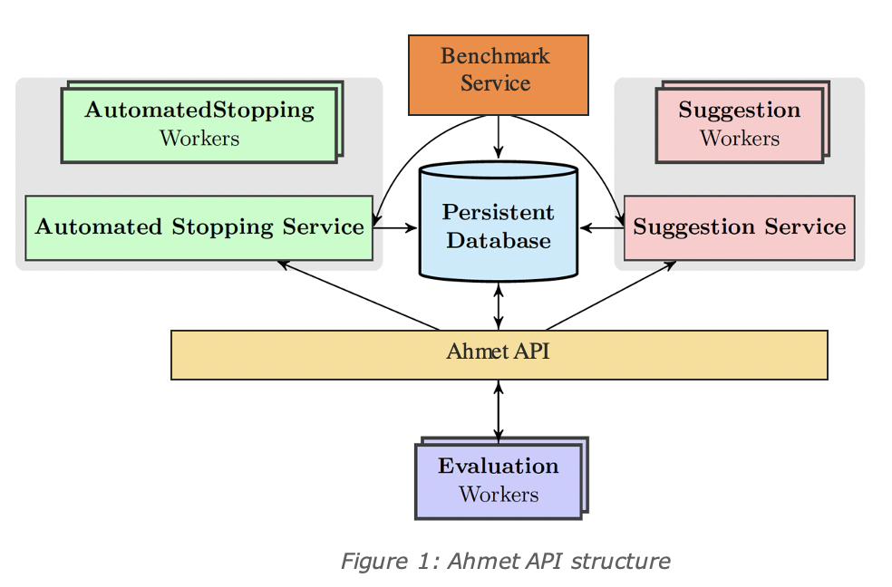
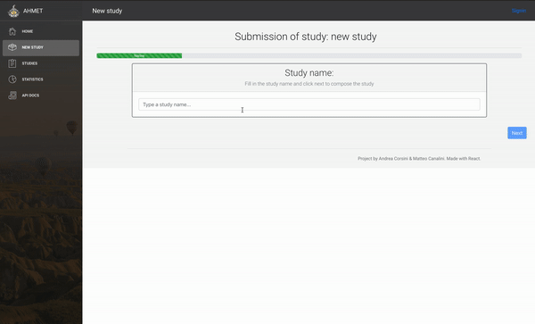
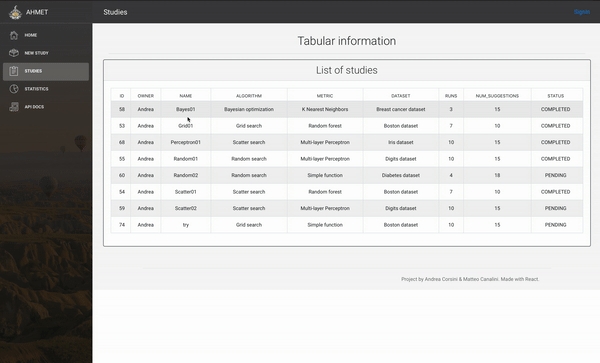
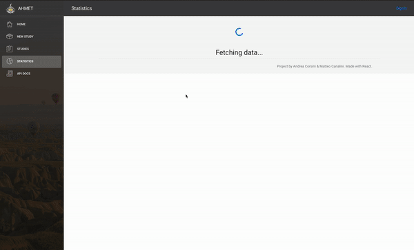

# Ahmet

Ahmet the last Vizier is a web framework for Black-Box Optimization (BBO). 
In general, a BBO problem consists in optimizing an expansive and complex
function f with a limited budget of resources. The domain of f is usually a 
high dimensional space where each dimension varies in N,R or a limited subset 
of them.

## Table of contents

1. [Project structure](#project-structure)
2. [Installation and startup](#installation-and-startup)
3. [General description](#general-description)
4. [Main features](#main-features)
5. [Demos](#demos)
6. [References](#references)

## Project structure
    /
    |--> /Ahmet
    |     |--> urls.py: controllers of the API.
    |     |--> settings.py: settings of the API.
    |
    |--> /API
    |     |--> /Algorithms: folder containing the available BBO algorithms.
    |     |--> /Dataset: folder containing the dataset used by the metric.
    |     |--> /EarlyStoppings: folder containing the early stopping algorithms.
    |     |--> /Metrics: folder containing the metrics.
    |     |--> /Static: folder containing the pototypes and openapi specs.
    |  
    |--> /UI
    |     |--> /Webapp: folder containing the web application (front-end).
    |     |--> /Mobileapp: folder containing the mobile application (.apk).
    |
    |--> requirements.txt

## Installation and startup

### API installation:
The Ahmet's api needs only a valid Python 3 interpreter and can be easily
installed within a dedicated virtual environment. For creating a new venv in
Python 3:
    
    python3 -m venv /path/to/venv
    
Once the venv is installed, it must be activated before installing third-party 
libraries:
    
    source /path/to/venv/bin/activate
    
And then all the required libraries can be easily installed with:

    pip install -r /path/to/requirements.txt
    
Make sure to use the right path to the requirements.txt file.
The last step required before having correctly set up the API, is the
database migration step. Still in the venv, type the following two lines:

    python manage.py makemigrations
    python manage.py migrate
    
This should be enough for creating a local database that will be used by the
api. Finally, you can start the api with:

    python manage.py runserver localhost:8080
    
### Web App installation:

The Web Application is a Single Page Application leveraging React framework.
This means you need a valid Node.js runtime environment and the related
packet manager npm in order to build and test it. The Web App has been developed
using Node.js v14.3.0 and npm version 6.14.4, thus it is strongly recommended
to download the same versions.
Once everything is installed and set up, you just need to install the required
packages by simply invoking:
    
    npm install 

Note that the package.json file collecting all the necessary packages is
located at ./UI/Webapp/, therefore you have to call the previous command in
the same directory for letting npm finds everything the app needs.
If everything goes fine, you can start the Web App up by typing:

    npm run start

### Mobile app installation:

The Mobile app is created with React Native framework relying only on without 
React Native Cli (without using Expo Cli). Before starting, make sure you have
the environment set up in the section React Native Cli Quickstart for your
system:

https://reactnative.dev/docs/environment-setup

The Mobile App has been developed using Node.js (v14.3.0) and npm (v6.14
.4), thus, it is strongly recommended to download the same versions.
Once you have downloaded the folder, you need to install all the dependencies by
running:
    
    npm install
    
After that, you need to run the Metro Bundler. If you want to know more about
Metro, check: 

https://facebook.github.io/metro/ 

So type in a terminal:
    
    react-native start
    
Finally install and run the application in a mobile phone or in a Android
emulator typing:
 
    react-native run-android

## General description

### Definitions

- **Trial**: a configuration (or tuple) of parameter values that will be
 evaluated
 against the BBO function f.
- **Metric**: a complex and computational heavy function f, such as a Machine
 Learning or a Neural Network model.
- **Optimization algorithm**: an algorithm that takes in a metric and a
 parameter space and generates trials. 
- **Study**: entity composed of an optimization algorithm, a metric, a set of
 trials and a dataset, if needed.
- **Worker**: a process or a thread responsible of evaluating trials
 against a metric.
- **Run**: an single iteration of an optimization algorithm that generated
 trials.

### The Framework

Ahmet has been primary designed to evaluate and point out the quality and
characteristics of different optimization algorithms. The metrics used to test
the algorithms are ML and NN models which constitute really tough BBO
problems.

The entire framework is extensible, meaning that new metrics, algorithms and
dataset can be added by end-users. Currently, the extension process is not
automatic, but it needs a revision by a developer before the proposed metric,
algorithm or dataset can be used in new studies.
For instance, If an end-user wants to develop its own optimization algorithm,
he can download the algorithm prototype from the Web App home page and start to
build it from there. The prototype is an abstract class from which every
algorithm must inherit. In this way, Ahmet can rely on a well established
interface for interacting with the algorithms, even if their internal behavior
is completely unknown. The same apply to the Metric and the Dataset.

The available BBO algorithms in the framework are:

- Grid Search
- Random Search
- Scatter Search
- Bayesian Optimization

While the metrics are:

- Random Forest
- Support Vector Machine
- Simple Function (polynomial function)
- Nearest Neighbor
- Multi Layer Perceptron

And the datasets:

- Mnist/Digits
- Boston
- Breast Cancer
- Iris
- Diabetes

### Inside Ahmet

What Ahmet does is to take a searching space, the hyperparameter space, and 
produce configurations of hyperparameters, or trials, from such space. 
Depending on the algorithm selected in a running study, these trials might be
generated in a completely different way. Broadly speaking, an algorithm samples
trials from the study space and it refines its exploration based on the
outcome of the past trials and its internal nature. Usually, the algorithm
generation procedure is splitted up in iterations called run. A run generates
several trials that will be evaluated by Ahmet workers. Both the algorithm
runs and number of trials generated at each run, namely number of suggestions, 
are parameters configured during the study creation.

Once a set of trials is ready, the pool of workers start to evaluate each one
based on the study metric. Remember that the metrics in Ahmet are ML or NN
models, so evaluating each trial implies to train the model on a dataset
and afterword test the trained model. This is the computational heavy part of
the framework.

In order to ease the evaluation process, some basic early stopping procedures
may decide to stop the trials before their actual evaluation. This part of
the framework is not deeply developed yet, but it is an important feature
that could lead to superior performance if well managed. It is important to
note also that the algorithms should exploit as much as possible the
knowledge produced by the evaluated trials in order to increase the final
trials quality and speed up the study execution.   

The studies as well as their results are presented in the Mobile and Web apps
with two pages. The first page, called studies, presents the studies, the 
studies hyperparameters and the studies trials in a tabular fashion. 
This can be useful to check the characteristics of each study.
While the second page, the statistics page, tries to summarize some general
aspects of a single study (selected by the end-user) or of the BBO algorithms.
Take a look at the demos below for getting some more insights.

## Main features

### API

- **Model View Controller** paradigm.
- **Introspection** for easily adding new algorithms, datasets and metrics.
- **Multi-threading** for asynchronous requests-responses. This part can be
 further improved with a broker and a pool of processes.
- **Django Rest Framework**.
- **API token-based** protection.

## Demos

#### Creation of studies

#### Studies table

#### Statistics

## References

Inspired by: https://research.google/pubs/pub46180/
